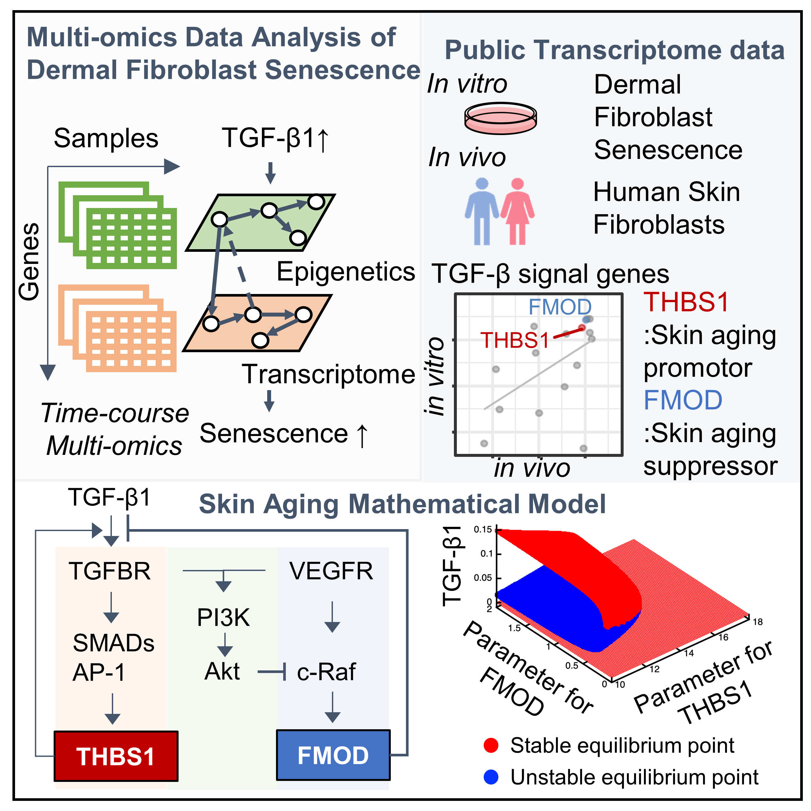

# Haga2023
**Highlights**
- Multi-omics analysis identified TGFβ1-SMAD4 as a key regulatory axis in human skin aging
- THBS1 and FMOD identified as promoting and suppressing factors in skin aging, respectively
- Mathematical model specific to the human skin aging suggested THBS1 as a controllable while FMOD as uncontrollable factor
- SMAD4 is a potential target for inhibition of THBS1 and cell senescence

<br>



## Installation

```
$ git clone https://github.com/okadalabipr/Haga2023.git
```

## Contents

- [`modeling/`](./modeling/): mathematical modeling of TGFβ and VEGF signaling pathway dynamics on skin aging
- [`bioinformatics/`](./bioinformatics/): sequencing data analysis

## License

MIT
